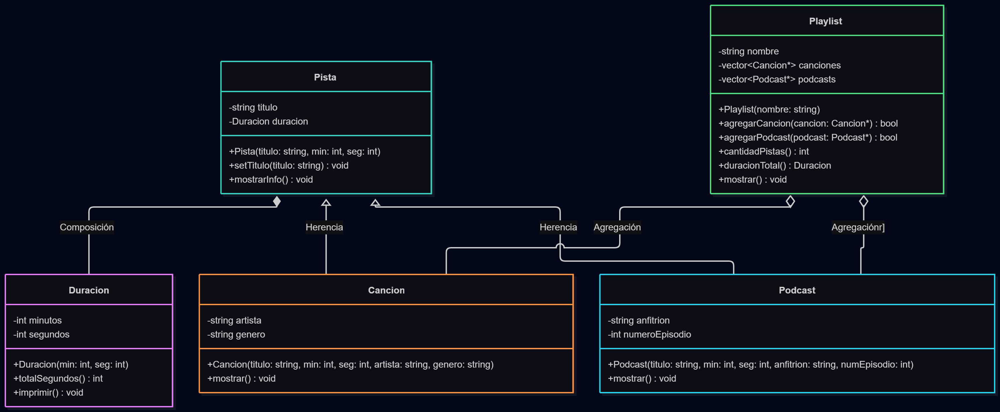

# Práctica 1: Playlist de música

Programación Orientada a Objetos · Ingeniería Mecatrónica · Tercer semestre

## Fase 1. Entender el problema

**1.1 El problema con mis propias palabras**

Es una aplicacion que acomoda en playlist canciones y podcast donde la playlist tiene un nombre trae las pistas de una biblioteca no las crea y tambien dice la duracion total de la suma de todas las pistas que tiene dentro las canciones denen tener un artista y genero y el podcast anfitrion y numero de episodio pero los dos deben tener duracion y nombre.

**1.2 Sustantivos (posibles clases) y verbos (posibles métodos)**

Sustantivos:
1. Canción
2. Podcast
3. Playlist
4. Pista
5. Duración

Verbos:
1. Organizar
2. Reunir
3. Reportar

**1.3 Relaciones** (completa con "es un", "tiene un" o "usa un")

*   Una canción USA UNA  pista.
*   Un podcast USA UNA pista.
*   Una pista TIENE UNA  duración.
*   Una playlist USA UNA canción.

## Fase 2. Diseñar la solución

**2.1 Diagrama de clases**

**2.2 Justificación de cada relación**

| Relación | Tipo | ¿Por qué? |
| --- | --- | --- |
| Cancion - Pista | Herencia | Una canción tiene una pista |
| Podcast - Pista | Herencia | Un podcast tiene una pista |
| Pista - Duracion | Composición | La pista tiene una duración |
| Playlist - Cancion | Agregación | La playlist solo usa la canción existente |
| Playlist - Podcast | Agregación | La playlist solo usa el podcast existente |

## Fase 3. Implementar

**3.1 Bitácora de dudas**

| # | Duda | Cómo la resolví | Fuente |
| --- | --- | --- | --- |
| 1 | Como mostrar bien los minutos  |use la libreria <iomanip> para darle formato|copilot|
| 2 | Playlist no debe hacer delete de sus canciones en el destructor | Playlist solo guarda punteros y no es dueña de la memoria | copilot |
| 3 | La Duracion se construye en la lista de inicialización | composición tiene que construir los objetos antes de ejecutar el constructor | copilot |

**3.2 Experimentos guiados**

Experimento 1, orden de construcción y destrucción: primero se ejecuta el constructor de la clase base y luego el de la derivada. Al destruirse es inverso

Experimento 2, ¿quién es dueño de quién?: Pista es dueña de Duracion por composicion y Playlist Nno es dueña de las canciones ni de los podcasts, solo mantiene una relación de agregación

Experimento 3, un objeto en dos playlists: el cambio se refleja automáticamente en todas las playlists que apunten a esa misma pista pueden guardar la dirección del mismo objeto sin duplicar memoria

## Fase 4. Probar y mejorar

**4.1 Tabla de pruebas**

| # | Caso | Resultado esperado | Resultado obtenido | ¿Pasa? |
| --- | --- | --- | --- | --- |
| 1 | Duración normal `Duracion(3, 45)` | 3:45 | 3:45 | si |
| 2 | Segundos mayores a 59 `Duracion(0, 75)` | 1:15 | 1:15 | si |
| 3 | Valores negativos `Duracion(-2, 10)` | 0:00 | 0:00 | si |
| 4 | Título vacío | "Sin título" | "Sin título" | si |
| 5 | Playlist vacía | 0:00 y 0 pistas | 0:00 y 0 pistas | si |
| 6 | Canción duplicada | La segunda vez devuelve `false` | Devuelve false | si |
| 7 | Puntero nulo | Devuelve `false` | Devuelve false | si |
| 8 | Total con 2 canciones y 1 podcast | Suma correcta en m:ss | m:ss | si |

**4.2 Bitácora de mejoras**

| # | Falla o mejora detectada | Qué cambié | Por qué |
| --- | --- | --- | --- |
| 1 | Ordenar la playlist por duración | Agregué el método `ordenarPorDuracion()` en `Playlist` | Para organizar mejor las pistas de la playlist según el tiempo |
| 2 | Ver la pista más larga y la más corta | Agregué `mostrarPistaMasLarga()` y `mostrarPistaMasCorta()` | Para identificar rápidamente la pista con mayor y menor duración |

Retos opcionales que intenté: 2

## Fase 5. Publicar en GitHub

**5.1 Enlace a mi fork**

https://github.com/nestor-lopez-07/ulsa_ime_3_poo_playlist

## Cierre y reflexión

**6.1 ¿Qué aprendiste en esta práctica?**

Aprendí a hacer un diagram de clases. También entendí cómo una playlist puede contener referencias a canciones y podcasts sin ser dueña de su memoria.

**6.2 ¿Qué cambiarías de tu proceso la próxima vez?**

La próxima vez planearía mejor la estructura del proyecto, También me gustaría hacer pruebas más ordenadas desde el inicio y documentar cada duda para evitar errores.